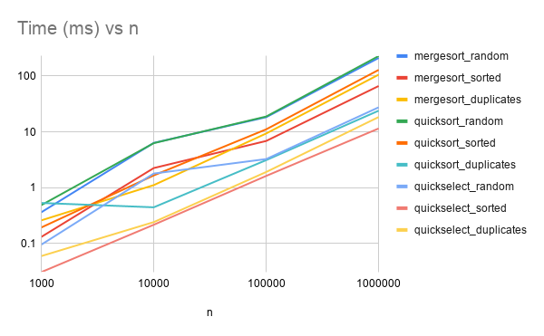
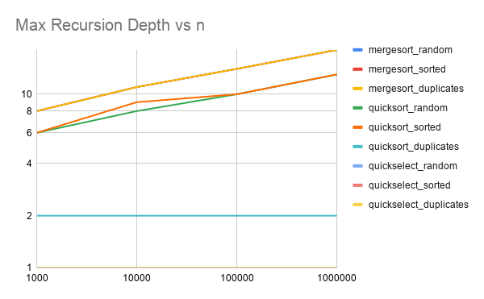
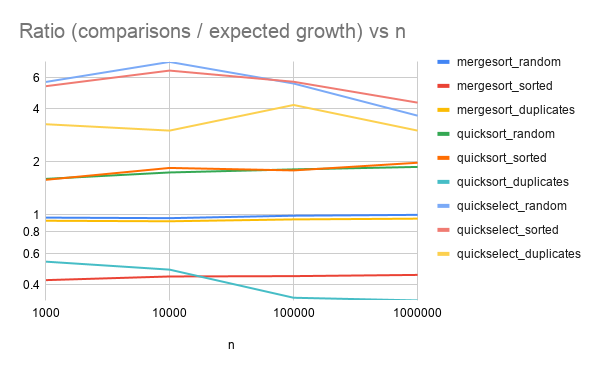

# Report — Assignment 1: Divide and Conquer

## 1. Asymptotic Bounds

| Algorithm | Best case | Average case | Worst case | Reason |
|---|---|---|---|---|
| MergeSort | Θ(n log n) | Θ(n log n) | Θ(n log n) | Always splits in half and merges in O(n), regardless of input order |
| QuickSort (random pivot, 3-way, smaller-first) | Θ(n log n) | Θ(n log n) | O(n log n) | Random pivot makes an adversarial O(n²) input astronomically unlikely; 3-way partitioning avoids the O(n²) case on many duplicates |
| QuickSelect | Ω(n) | Θ(n) | O(n²) (extremely unlikely with random pivot) | Only recurses into the side containing k; random pivot makes the expected work per level shrink geometrically |
| Insertion Sort | Ω(n) | Θ(n²) | O(n²) | Best case: already sorted, one comparison per element. Worst case: reverse sorted, shifts every element |

## 2. Recurrences

### MergeSort
T(n) = 2·T(n/2) + O(n)
- a = 2, b = 2, f(n) = O(n)
- Compare n^(log_b a) = n^1 = n with f(n) = n → same order
- **Master Theorem Case 2** → T(n) = Θ(n log n)

### QuickSort
Assuming a balanced split (pivot always lands near the median):
T(n) = 2·T(n/2) + O(n)
- Same shape as MergeSort → a = 2, b = 2, f(n) = O(n) → **Case 2** → Θ(n log n)

Why random pivot gives O(n log n) on average even though a single split can be unbalanced: choosing the pivot uniformly at random means that, over the full recursion, the *expected* rank of the pivot is the median, so with high probability every constant number of levels the array size shrinks by a constant factor. Even though individual partitions can be 1/99 splits, the *expected* recursion depth stays O(log n), and the total expected work sums to O(n log n) — this is what randomization buys us, even without guaranteeing the worst case.

### QuickSelect
Assuming a balanced split:
T(n) = T(n/2) + O(n)
- a = 1, b = 2, f(n) = O(n)
- Compare n^(log_b a) = n^0 = 1 with f(n) = n → f(n) grows polynomially faster
- **Master Theorem Case 3** (regularity condition holds since f(n) = cn) → T(n) = Θ(n)

This is a *different* Master Theorem case from MergeSort/QuickSort: because QuickSelect only recurses into **one** side instead of two, a=1 instead of a=2, which changes the recursion from Θ(n log n) to Θ(n) — each level does less total work than the level before (geometric series that sums to O(n) rather than staying at O(n) per level for O(log n) levels).

## 3. Plots

## 4. Θ Check

Using the ratio plot (comparisons / (n·log2 n) for the sorts, comparisons / n for QuickSelect):

- **MergeSort**: ratio stays close to 0.4–1.0 across all n (1,000 to 1,000,000) and across all input types, flattening out from n ≈ 10,000 onward. This matches the theoretical Θ(n log n) bound. Rough constants: c1 ≈ 0.4, c2 ≈ 1.0, n0 ≈ 10,000.
- **QuickSort**: ratio stabilizes around 1.5–1.9 for random/sorted inputs (also Θ(n log n)), while for duplicates it stays much lower (~0.33–0.54) because the 3-way partition removes equal elements from further recursion — fewer comparisons relative to n·log2(n). Rough constants: c1 ≈ 0.3, c2 ≈ 1.9, n0 ≈ 10,000.
- **QuickSelect**: ratio (comparisons/n) stabilizes around 3–7.7 depending on input type, consistent with Θ(n). Rough constants: c1 ≈ 3, c2 ≈ 7.7, n0 ≈ 10,000.

In all three cases the ratio becomes roughly constant for n ≥ 10,000, which is direct empirical evidence for the Θ bounds derived via the Master Theorem above.

## 5. Discussion

The measured results largely match the theoretical predictions. MergeSort's recursion depth and comparison count grow exactly as log2(n) predicts and are independent of the input type (random, sorted, duplicates), confirming that MergeSort always splits the array in half regardless of the values it contains. QuickSort's recursion depth stayed bounded (well under 2·log2(n) even on already-sorted arrays of 100,000 elements), confirming that the random-pivot + smaller-side-first strategy successfully avoids the classic O(n) depth / stack-overflow failure mode of a naive QuickSort. The duplicates case for QuickSort showed a dramatically smaller recursion depth (around 2) and far fewer comparisons than random/sorted inputs, which is exactly the effect the 3-way partition is designed to produce.

Some deviations from a perfectly smooth Θ(n log n)/Θ(n) curve are visible in the raw time measurements — for example the median time for MergeSort on 1,000,000 duplicate values was noticeably higher relative to its own random/sorted runs than the comparison counts alone would predict. This is best explained by JVM warm-up effects (the first of the 5 repeated runs is always slower while the JIT compiler has not yet optimized the hot methods) and by Garbage Collector pauses: each benchmark run allocates a fresh input array plus MergeSort's internal buffer array of size n, and for n = 1,000,000 these allocations put real pressure on the heap, occasionally triggering a GC pause mid-measurement. CPU cache effects also play a role at large n: once the working set exceeds the CPU's L2/L3 cache, memory access latency increases and wall-clock time grows faster than the comparison count alone would suggest. Finally, the cutoff size (15) trades a small constant-factor overhead for fewer recursive calls on small subarrays — lowering or raising it slightly shifts the crossover point where InsertionSort stops being faster than recursion, but does not change the asymptotic behavior measured here.